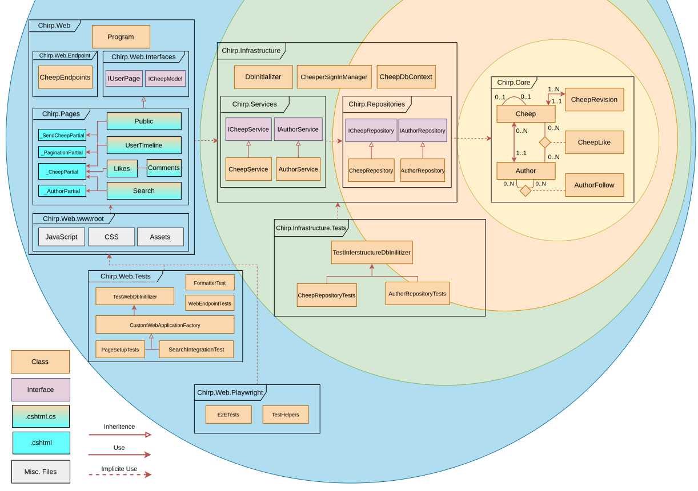

# Design and Architecture of _Chirp!_

## Domain model


## Architecture — In the small
**Onion Diagram**

Each layer of the onion architecture represents a dotnet project or dotnet test project - A dotnet project may have mutible sub _projects/folders_ that only can _use_ or _implicite use_ from other projects or sub-project.
Only individual files (classes, interfaces, .cshtml, ...) can inherit from each others, but may only be shown implicitly in the diagram.
## Architecture of deployed application

## User activities

## Sequence of functionality/calls trough _Chirp!_

# Process

## Build, test, release, and deployment

When a commit is pushed to a branch which currently is used for a pull request a workflow is ran on the commit. The workflow, builds, run all the tests and lints the code. If any of these fail or if any warning occour then the workflow will fail. Preventing the proposed changes from being merged into the main branch.


The following diagram shows one of the workflows that is being ran when a tag is pushed to the main branch. This workflow is building the artifacts for Linux, MacOS and Windows, which is then included in the GitHub release for that tag.


The other workflow that is being ran when a tag is pushed to main, is the workflow responsible for Azure deployments.


## Team work

When requirements from the course were published, the group would either delegate the different issues and users stories to be created by different group members, or one or two individuals would write them out by themselves as quickly as possible. This allowed the group to quickly be aware of what the current issues were, and allowed members to assign themselves to these issues.

Similarly, if a bug was found, or group members agreed on a new functionality of the program, someone was quickly assigned to make an issue. A single issue was usually worked on by anywhere between 1 and 3 group members according to the scale of the issue.

The group utilized some pair programming at the start of the project, although it developed into more individually focused programming. If a member needed help on they would usually contact other members on a discord server, which was the primary communication platfrom utilized by the group. This server also included a bot that sent a message whenever there was activity with issues or pull requests on the repository.

When a feature was done, an effort was made to test this feature. Unfortunately this was not done for every feature, and is something the group has agreed to work more on in future projects. This resulted a backlog of testing that had to be worked on by all group members towards the end of the project.

When a feature was deemed ready by the creator, a pull request would be made. If any other group member had good knowledge of the part of the program the feature would interact with, they would be requested as a reviewer, although this was not always possible. The reviewer would ensure that the program worked as intended, and then approve it if no further changes were needed. An approval was needed to merge into main, as branch protection was in place.


## How to make _Chirp!_ work locally

Clone repository
```sh
git clone https://github.com/ITU-BDSA2024-GROUP17/Chirp
```

Change directory
```sh
cd Chirp
```

_Note: To enable login via GitHub OAuth, the following environment variables needs to be set._

| Environment variable | Description                            |
|:--------------------:|----------------------------------------|
|    GHUB_CLIENT_ID    | Id of the GitHub OAuth application     |
|  GHUB_CLIENT_SECRET  | Secret of the GitHub OAuth application |

### How to run development instance

Run the 'Chirp.Web' project
```sh
dotnet run --project ./src/Chirp.Web
```

Chirp will now begin to build and then run when it is finished.

The website can then be accessed via http://localhost:5163 in a browser.

_Note: Informatory logs (some libaries are set to only print warnings) will be printed to standard out (the terminal)._

### How to run production build

Build the project for production
```sh
dotnet publish src/Chirp.Web -c Release
```

Change directory
```sh
cd src/Chirp.Web/bin/Release/net8.0/publish
```

Run production build
```sh
dotnet Chirp.Web.dll
```

The website can then be accessed via http://localhost:5000 in a browser.

_Note: Informatory logs (some libaries are set to only print warnings) will be printed to standard out (the terminal)._

_Note: To expose the site to the general internet, either a port forward or, a deployment to a hosting provider would be required._

## How to run test suite locally

_Note: The following steps should be performed from the root of the repo._

Build the solution
```sh
dotnet build
```

Install required browsers
```sh
pwsh test/Chirp.Web.Playwright/bin/Debug/net8.0/playwright.ps1 install
```

Start a development server
```sh
dotnet run --project src/Chirp.Web
```

_Note: The tests needs to be ran from another terminal, since Playwright needs to access an actual running instance of Chirp!._

```sh
dotnet test
```

### Run individual tests

Change directory to desired test directory
```sh
cd test/Chirp.Web.Tests
```

_Note: See "The different test suites" section for available test suites._

Run tests in the desired directory
```sh
dotnet test
```

### The different test suites

Chirp currently includes 3 suites.

* Chirp.Infrastructure.Tests
* Chirp.Web.Playwright
* Chirp.Web.Tests

#### Chirp.Infrastructure.Tests

Contains Unit tests regarding the infrastructure project. Along with integration tests that focuses on how the infrastructure project and the database is working togheter.

#### Chirp.Web.Playwright

All of the end-to-end tests are located in this suite. To run these tests a development server needs to be running before the tests are started.

#### Chirp.Web.Tests

Unit tests and integration tests involving the Web project is location in this test suite.

These includes various helper methods and endpoints.

# Ethics

## License

Chirp is licensed under [MIT](https://opensource.org/license/mit)

## LLMs, ChatGPT, CoPilot, and others
As it gets normalized to use LLM's while coding in a project, it gets more important to be transparent when using these tools to create. Therefore we have taken steps to document when using LLM's, both directly and indirectly.
To be transparent about these tools, the members of our group are obilgated to co-author every commit and pull-request that was realized with the help of these tools. But as a general non-formal consensus, we did not extensively
make use of LLM's and generative tools to directly write code for our program, but rather used it for inspiration for what solutions exists.
